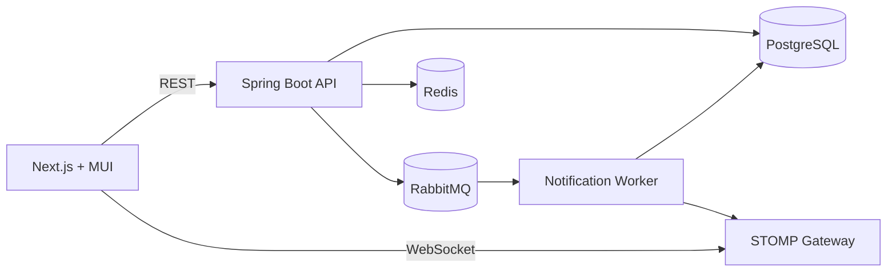

# Campus Notification Platform

A production-ready campus notification platform that delivers event, result, and placement notifications with real-time updates, priority inbox ranking, and scalable async processing.

## Architecture Overview



## Features

- Real-time notifications via WebSocket + STOMP
- Priority inbox with scoring based on type and recency
- Pagination, filtering, and read/unread tracking
- Redis caching with eviction
- Async bulk notification processing with RabbitMQ
- Rate limiting and request logging middleware
- Mock JWT authentication for student context
- Swagger/OpenAPI documentation
- Docker and CI workflows

## Tech Stack

- Backend: Spring Boot 3, Java 17, PostgreSQL, Redis, RabbitMQ, MapStruct
- Frontend: Next.js, React, Material UI, React Query, Axios
- DevOps: Docker, Docker Compose, GitHub Actions

## Project Structure

```
root/
├── backend/
├── frontend/
├── docker-compose.yml
├── README.md
├── .gitignore
```

## Backend Setup

### Local (Maven)

```
cd backend
mvn spring-boot:run
```

### Docker

```
docker compose up --build
```

## Frontend Setup

```
cd frontend
npm install
npm run dev
```

## Environment Variables

Backend (defaults already configured in application.yml):

- DB_URL
- DB_USER
- DB_PASSWORD
- REDIS_HOST
- REDIS_PORT
- RABBIT_HOST
- RABBIT_PORT
- MOCK_JWT_ENABLED

Frontend:

- NEXT_PUBLIC_API_BASE_URL
- NEXT_PUBLIC_WS_URL
- NEXT_PUBLIC_STUDENT_ID

## API Documentation

Swagger UI is available at `/swagger-ui` after starting the backend.

### Endpoints

- `GET /api/v1/notifications` - list notifications with pagination/filtering
- `GET /api/v1/notifications/{id}` - get notification details
- `PATCH /api/v1/notifications/{id}/read` - mark a notification as read
- `PATCH /api/v1/notifications/read-all` - mark all notifications read
- `GET /api/v1/notifications/priority` - priority inbox
- `POST /api/v1/notifications/bulk` - queue bulk notifications

## Data Model

Notification fields:

- `id` (UUID)
- `studentId`
- `type`
- `message`
- `isRead`
- `priorityScore`
- `createdAt`

Indexes:

- (student_id, is_read, created_at)
- (student_id, type, created_at)
- (student_id, priority_score, created_at)

## Priority Inbox Logic

- Base score by type: Placement > Result > Event
- Recency bonus: higher score for newer notifications
- Min-heap maintains top 10 notifications efficiently

## Async Processing Flow

1. HR triggers bulk notification
2. Request is queued in RabbitMQ
3. Worker consumes messages with retry and dead-letter handling
4. Notifications are persisted
5. WebSocket pushes updates to clients

## Caching Strategy

- Notification list and priority inbox are cached per student
- Cache entries expire on a short TTL
- Cache eviction occurs on read updates and bulk operations

## Performance Optimizations

- Pagination and indexed queries
- Composite indexes for common filters
- Selective pagination with bounded sample for priority inbox
- Redis-backed caching

## Scalability Notes

- RabbitMQ isolates spikes in bulk notifications
- Stateless API supports horizontal scaling
- Redis offloads repeated read traffic

## CI/CD

The GitHub Actions workflow builds the backend, runs tests, and builds the frontend on each push and PR.

## Screenshots

The UI includes a dashboard, notifications list, priority inbox, and details view. Capture them after launching the frontend for submission.

## Design Decisions and Tradeoffs

- Mock JWT allows consistent student identity without an auth provider
- Priority inbox computes from recent samples to keep complexity low
- WebSocket and REST are decoupled for scalability
- Redis TTL keeps cache fresh without heavy invalidation

## Run with Docker Compose

```
docker compose up --build
```

Frontend: http://localhost:3000
Backend: http://localhost:8080
RabbitMQ Management: http://localhost:15672
